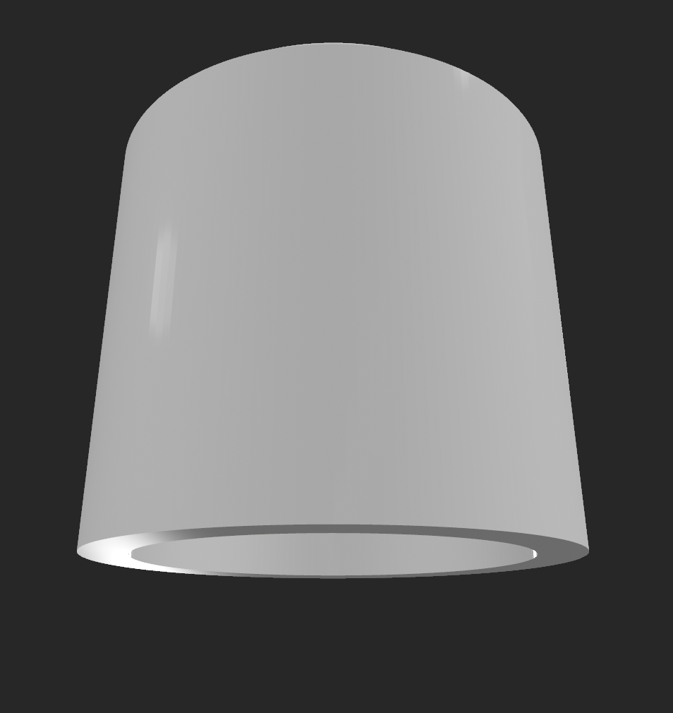

# Macropad

A custom programmable macropad designed and built as part of my Hack Club Stardance project.


## Overview

This project is a custom macropad designed to provide a compact way to use shortcuts and macros.

I designed the physical parts of the macropad around the PCB, including the top case, bottom case and knob. The project also includes the PCB, firmware, CAD files and manufacturing files required to build the macropad.

## Features

* Custom PCB
* Programmable keys
* Rotary knob
* USB connection
* Custom-designed case
* Custom firmware
* 3D-printed physical parts
* Manufacturing-ready PCB files
* STEP CAD files

## Design

The macropad is made up of several physical parts that fit together around the PCB. The top and bottom cases hold the electronics in place, while the knob provides an additional input.

### Top Case


### Bottom Case


### Bottom of the Top Case


### PCB

The PCB contains the electronics used by the macropad and connects the different components together.


### Knob

The macropad also includes a rotary knob.




### Other Side of the Bottom Case


## How It Works

When a key is pressed, the PCB detects the input and the microcontroller processes it. The firmware then sends the corresponding keyboard input to the computer through USB.

The rotary knob provides an additional input that can be programmed for different functions.

The PCB and physical case were designed to work together so that the components fit inside the finished macropad.

## Firmware

The firmware controls the behaviour of the macropad and allows it to communicate with a computer.

The production firmware is included in the `Macropad` folder.

## Production Files

The production files are stored inside the `Macropad` folder.

These include:

* Firmware
* CAD files
* Gerber files for PCB manufacturing
* Bill of Materials

The CAD files are provided in STEP format for the final production version.

## Bill of Materials

The Bill of Materials is included in the `Macropad` folder as `BOM.csv`.

It contains the components and quantities required to build the macropad.

## Development Journal

The development process is documented in [`Journal.md`](Journal.md).

The journal contains information about the development of the macropad and the work completed during the project.

## Repository Structure

```text
Macropad/
├── Images/
│   ├── Bottom of top case.png
│   ├── Pcb image.png
│   ├── Top case.png
│   ├── bottom case.png
│   ├── bottom of knob.png
│   ├── knob.png
│   └── other side of bottom.png
│
├── Macropad/
│   ├── BOM.csv
│   └── production/
│       ├── firmware/
│       ├── CAD/
│       └── gerber.zip
│
├── Journal.md
└── README.md
```

## Credits

Made by Aaran as part of Hack Club Stardance.

Thanks to Hack Club for providing Stardance and the resources that made this project possible.
